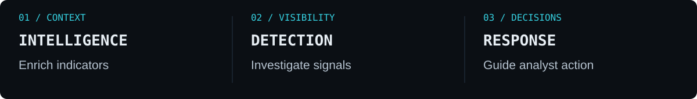
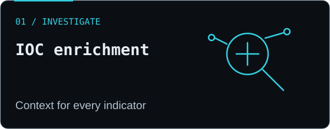
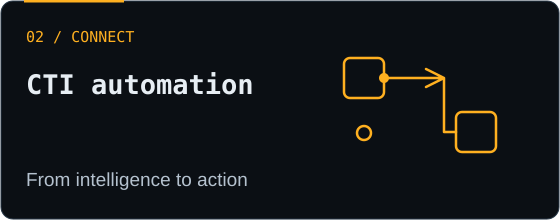
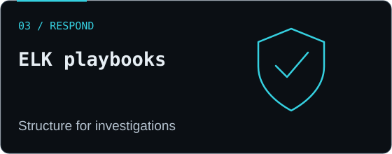
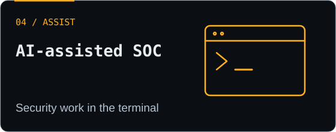

  

<h1 align="center">Building practical tools for stronger security operations</h1>

  Threat Intelligence · SIEM &amp; Detection Engineering · Incident Response · AI-Assisted SOC

  
  
  
  

  <a href="#featured-projects">Featured projects</a> ·
  <a href="#project-directory">All projects</a> ·
  <a href="#live-websites">Live websites</a> ·
  <a href="#threat-intelligence-feeds">IOC feeds</a> ·
  <a href="#security-toolkit">Security toolkit</a> ·
  <a href="#credentials-and-learning">Credentials</a>

## About me

I'm **Amit Ambekar**, a cybersecurity engineer and threat intelligence researcher building tools and resources for security operations teams. My work connects **threat intelligence, detection engineering, incident investigation, and automation**.

I focus on making security information useful: enriching indicators, organizing response playbooks, and helping analysts move from an alert to an informed decision. I also share practical cybersecurity knowledge through **The Safehouse**.

## Featured projects

**Choose a starting point:** enrich an IOC, prepare an investigation prompt in a browser, explore a CTI workflow, or investigate with an ELK playbook.

<table>
<tr>
<td width="50%" valign="top">

<h3>🔎 IOC Enrichment Console</h3>

Investigate IPs, domains, and SHA256 hashes with multi-source enrichment, visual dashboards, and exportable reports.

<strong>Next.js · Flask · Threat intelligence APIs</strong>

<a href="https://github.com/amitambekar510/ioc-enrichment-console">Explore the console →</a>

</td>
<td width="50%" valign="top">

<h3>⚡ CTI Automation Chain</h3>

Connect intelligence analysis, detection engineering, automation workflows, and response reporting in a staged pipeline.

<strong>Python · Feedly CTI prompts · OpenCode</strong>

<a href="https://github.com/amitambekar510/cti-automation-chain">Explore the pipeline →</a>

</td>
</tr>
<tr>
<td width="50%" valign="top">

<h3>🛡️ ELK Incident Response Playbooks</h3>

Structured investigation and response resources covering endpoint, identity, network, cloud, and threat intelligence scenarios.

<strong>Elastic / ELK · YAML · Incident response</strong>

<a href="https://github.com/amitambekar510/elk-ir-playbooks">Explore the playbooks →</a>

</td>
<td width="50%" valign="top">

<h3>⌨️ SOC Nemotron Workbench &amp; CLI</h3>

Prepare investigation prompts in a local browser workbench with guided inputs, sample data, prompt preview, copy, and Markdown download. Use reviewed prompts through OpenCode for AI-assisted investigations.

<strong>Python · Browser workbench · OpenCode · NVIDIA Nemotron</strong>

<a href="https://github.com/amitambekar510/SOC-Nemotron-CLI">Explore the CLI →</a> · <a href="https://github.com/amitambekar510/SOC-Nemotron-CLI-Linux">Linux</a> · <a href="https://github.com/amitambekar510/SOC-Nemotron-CLI-Windows">Windows</a>

</td>
</tr>
</table>

## Project directory

<strong>Browse all public security projects by purpose</strong>

| Project | What it provides | Format |
| :--- | :--- | :--- |
| [IOC Enrichment Console](https://github.com/amitambekar510/ioc-enrichment-console) | Multi-source enrichment for IPs, domains, and hashes, with streamed results, maps, and report exports | Next.js + Flask application |
| [SOC Nemotron Workbench & CLI](https://github.com/amitambekar510/SOC-Nemotron-CLI) | Local prompt preparation for IOC extraction, detection drafts, and investigation workflows | Browser workbench + operating guide |
| [SOC Nemotron — Linux](https://github.com/amitambekar510/SOC-Nemotron-CLI-Linux) | Linux setup guidance and operational prompt templates | Platform guide |
| [SOC Nemotron — Windows](https://github.com/amitambekar510/SOC-Nemotron-CLI-Windows) | Windows, PowerShell, and WSL2 guidance for AI-assisted SOC workflows | Platform guide |
| [CTI Automation Chain](https://github.com/amitambekar510/cti-automation-chain) | Staged intelligence analysis, detection engineering, automation, and response reporting | Python workflow project |
| [Elastic / ELK Detection Rules](https://github.com/amitambekar510/Safehouse-MITRE-Attack-Detection-Rules-Elastic-ELK) | MITRE ATT&CK-mapped TOML rules with investigation and tuning guidance | Detection-rule collection |
| [ELK Incident Response Playbooks](https://github.com/amitambekar510/elk-ir-playbooks) | Structured endpoint, identity, network, cloud, and CTI investigations | Playbook collection |
| [SIEM Graph Investigation Playbook](https://github.com/amitambekar510/SIEM-Graph-Investigation-Playbook) | Investigation pivots for Kibana Graph and OpenCTI | Investigation reference |
| [SOC DarkWatch](https://github.com/amitambekar510/SOC-DarkWatch) | Phased planning, architecture, and governance for defensive monitoring | Implementation roadmap |
| [Sentinel IOC Block](https://github.com/amitambekar510/sentinel-ioc-block) | Proposed threat-feed ingestion and perimeter-firewall blocking workflow | Proposal / proof of concept |
| [Nessus Authenticated VA Guide](https://github.com/amitambekar510/nessus-authenticated-va-scan-guide) | Credentialed vulnerability-assessment setup for Windows and Linux servers | Configuration guide |
| [Linux System & FIO Reports](https://github.com/amitambekar510/system-report-script) | System inventory, account checks, and disk benchmarks with HTML, text, CSV, and JSON outputs | Bash reporting script |
| [Malicious IP Threat List](https://github.com/amitambekar510/Malicious-IP-Threat-List) | IP indicator files, collection guidance, and update history | Threat-intelligence feed |
| [Malicious Domain Threat List](https://github.com/amitambekar510/Malicious-Domain-Threat-List) | Domain indicator files, collection guidance, and update history | Threat-intelligence feed |
| [Malicious Hash Threat List](https://github.com/amitambekar510/Malicious-Hash-Threat-List) | File-hash indicators, collection guidance, and update history | Threat-intelligence feed |

## Live websites

| Website | Explore | Built with |
| :--- | :--- | :--- |
| [Amit Ambekar Portfolio](https://portfolio.thesafehouse.in) | Career experience, security expertise, certifications, projects, and contact details | Next.js · TypeScript · Vercel |
| [The Safehouse](https://www.thesafehouse.in) | Organizational security awareness and personal digital safety services | Next.js · TypeScript · Vercel |
| [The Safehouse Journal](https://blog.thesafehouse.in) | Practical cybersecurity articles, topic tags, and reading series | Next.js · MDX · Vercel |

## Threat intelligence feeds

Explore the repositories for feed files, collection logic, usage guidance, and update history.

| Intelligence | Repository | Latest repository commit |
| :--- | :--- | :--- |
| 🌐 **IP addresses** | [Malicious IP Threat List](https://github.com/amitambekar510/Malicious-IP-Threat-List) |  |
| 🔗 **Domains** | [Malicious Domain Threat List](https://github.com/amitambekar510/Malicious-Domain-Threat-List) |  |
| 🔐 **File hashes** | [Malicious Hash Threat List](https://github.com/amitambekar510/Malicious-Hash-Threat-List) |  |

*Commit badges show repository activity, not feed validation or availability. Validate indicators in your environment before enforcement.*

## Security toolkit

| Area | Focus |
| :--- | :--- |
| **Threat intelligence** | IOC enrichment, reputation analysis, OTX, VirusTotal, AbuseIPDB |
| **Detection & investigation** | Elastic / ELK, Splunk, MITRE ATT&CK, investigation playbooks |
| **Endpoint & network security** | CrowdStrike, SentinelOne, FortiGate |
| **Automation & infrastructure** | Python, GitHub Actions, Docker, Linux |
| **AI-assisted operations** | OpenCode, Nemotron, CTI prompt workflows |
| **Governance interests** | Information security, privacy, AI governance, security documentation |

## Credentials and learning

<strong>View certifications and training</strong>

| Certification | Issuer |
|---------------|--------|
| **Certified Ethical Hacker (CEH)** | EC-Council |
| **Certified Incident Handler (CIH)** | EC-Council |
| **ISO/IEC 27001:2022 Lead Auditor** | Mastermind |
| **ISO/IEC 27701:2025 Lead Auditor** | Mastermind |
| **ISO/IEC 42001:2023 Lead Auditor** | Mastermind |
| **Cyber Threat Intelligence 101** | ArcX |
| **CNSP** | The SecOps Group |
| **CCSP** | The SecOps Group |
| **Certified AppSec Practitioner (CAP)** | The SecOps Group |
| **Certified AI Agent Security Specialist** | Proofpoint |
| **SailPoint Identity Security Leader** | SailPoint Technologies |
| **FALCON 101: Falcon Platform Essentials** | CrowdStrike University |
| **OT Security Expert (OOSE)** | OPSWAT Academy |
| **Seceon OTM Advanced & Foundation** | Seceon |
| **PCI DSS Awareness** | TÜV SÜD |
| **Microsoft Technology Associate** | Certiport |

<strong>View education, recognition, and current learning</strong>

| Education | Institution | Year |
| :--- | :--- | :--- |
| PGDBM in IT & Systems Management | Narsee Monjee Institute of Management Studies, Mumbai | 2025 |
| Cyber Law | Symbiosis Centre for Distance Learning, Pune | 2021 |

**Current learning:** CISM — Certified Information Security Manager.

**Recognition:** Best Employee of the Month, Most Promising Newcomer, and Bright Beginner Award at Audix Techno Consulting Solutions.

**Industry participation:** Event exhibitor and representative for Comtel Infosystems Private Limited.

## Writing and collaboration

I share practical security knowledge and welcome conversations about **threat intelligence, SOC tooling, detection use cases, and security automation**.

- **Read:** [The Safehouse Blog](https://blog.thesafehouse.in) · [Medium](https://medium.com/@amitambekar510) · [DEV Community](https://dev.to/amit_ambekar_c022e6732f8d)
- **Explore intelligence:** [My AlienVault OTX pulses](https://otx.alienvault.com/user/amitambekar/pulses)
- **Connect:** [LinkedIn](https://www.linkedin.com/in/amitmilindambekar/) · [Email](mailto:amit.ambekar@protonmail.com)
- **Contribute:** Open an issue or pull request in the relevant project with your improvement or feedback.

---

<strong>Defending networks, one indicator at a time.</strong> Amit Ambekar · <a href="https://www.thesafehouse.in">The Safehouse</a>

