<div align="center">

# 🛡️ Amit Ambekar — Cybersecurity Engineer & Threat Intelligence Researcher

[](https://github.com/amitambekar510)
[](https://www.linkedin.com/in/amitmilindambekar/)
[](mailto:amit.ambekar@protonmail.com)

</div>

---

<div align="center">

### 🔴 LIVE THREAT INTELLIGENCE FEEDS

| Feed | IOCs | Last Updated | Status | RAW Feed |
|------|------|--------------|--------|----------|
| 🌐 **Malicious IPs** | `149,000+` |  |  | [📥 Download](https://raw.githubusercontent.com/amitambekar510/Malicious-IP-Threat-List/main/Malicious-IP-Threat-List.txt) |
| 🔗 **Malicious Domains** | `138,700+` |  |  | [📥 Download](https://raw.githubusercontent.com/amitambekar510/Malicious-Domain-Threat-List/main/Blacklisted_Malicious_Domain_Repo.txt) |
| 🔐 **Malicious Hashes** | `85,400+` |  |  | [📥 Download](https://raw.githubusercontent.com/amitambekar510/Malicious-Hash-Threat-List/main/malicious_SHA256_hashes_aa.txt) |

**🔄 Auto-Updated every 12 hours via GitHub Actions** | **🚫 Zero duplicates guaranteed** | **✅ Validated against VT/AbuseIPDB**

</div>

---

## 🎯 Threat Intelligence Platform Overview

```mermaid
graph TB
    A[🔍 Threat Sources] --> B[🤖 Automated Collection]
    B --> C[✅ Validation Engine]
    C --> D[🚫 Deduplication]
    D --> E[📦 GitHub Repos]
    E --> F[🔥 Firewalls/SIEM/EDR]
    
    A1[AbuseIPDB] --> A
    A2[AlienVault OTX] --> A
    A3[FireHOL] --> A
    A4[Tor Project] --> A
    A5[URLhaus] --> A
    A6[MalwareBazaar] --> A
    A7[Custom Honeypots] --> A
    
    style A fill:#1a1a2e,stroke:#00ff41
    style E fill:#16213e,stroke:#ff8c00
    style F fill:#0f3460,stroke:#9b59b6
```



---

## 📊 Real-Time Feed Statistics

<div align="center">


</div>

### 📈 Feed Growth (Last 30 Days)
```
IPs:      ████████████████████ +2,847 new
Domains:  ██████████████████   +1,923 new
SHA256:   █████████████████████ +4,156 new
MD5:      ████████░░░░░░░░░░░░  +127 new
SHA1:     ██████░░░░░░░░░░░░░   +89 new
```

---

## 🛠️ Security Tool Integrations

<div align="center">

### Direct RAW Feed Integration — No Auth Required

| Platform | IP Feed | Domain Feed | Hash Feed | Config |
|----------|---------|-------------|-----------|--------|
| **Palo Alto EDL** | ✅ | ✅ | ✅ | [Guide](https://github.com/amitambekar510/Malicious-IP-Threat-List/wiki/Palo-Alto) |
| **FortiGate** | ✅ | ✅ | ✅ | [Guide](https://github.com/amitambekar510/Malicious-IP-Threat-List/wiki/FortiGate) |
| **Sophos XG/XGS** | ✅ | ✅ | ❌ | [Guide](https://github.com/amitambekar510/Malicious-Domain-Threat-List/wiki/Sophos) |
| **Microsoft Sentinel** | ✅ | ✅ | ✅ | [Guide](https://github.com/amitambekar510/Malicious-IP-Threat-List/wiki/Sentinel) |
| **Splunk ES** | ✅ | ✅ | ✅ | [Guide](https://github.com/amitambekar510/Malicious-IP-Threat-List/wiki/Splunk) |
| **IBM QRadar** | ✅ | ✅ | ✅ | [Guide](https://github.com/amitambekar510/Malicious-IP-Threat-List/wiki/QRadar) |
| **CrowdStrike Falcon** | ✅ | ✅ | ✅ | [Guide](https://github.com/amitambekar510/Malicious-Hash-Threat-List/wiki/CrowdStrike) |
| **ELK Stack** | ✅ | ✅ | ✅ | [Pipeline](https://github.com/amitambekar510/Malicious-IP-Threat-List/blob/main/elk-pipeline.conf) |
| **MISP** | ✅ | ✅ | ✅ | [Script](https://github.com/amitambekar510/Malicious-IP-Threat-List/blob/main/misp_import.py) |
| **SentinelOne** | ❌ | ❌ | ✅ | [Script](https://github.com/amitambekar510/Malicious-Hash-Threat-List/blob/main/sentinelone_import.py) |

</div>

---

## 🚀 Featured Projects

### 🔴 Threat Intelligence Feeds (Core)

| Repo | Description | Stars | Last Update |
|------|-------------|-------|-------------|
| **[Malicious-IP-Threat-List](https://github.com/amitambekar510/Malicious-IP-Threat-List)** | 149K+ malicious IPs from 7+ intel sources | ⭐ 0 |  |
| **[Malicious-Domain-Threat-List](https://github.com/amitambekar510/Malicious-Domain-Threat-List)** | 138K+ malicious domains, phishing, C2 | ⭐ 8 |  |
| **[Malicious-Hash-Threat-List](https://github.com/amitambekar510/Malicious-Hash-Threat-List)** | 85K+ malware hashes (MD5/SHA1/SHA256) | ⭐ 5 |  |

### 🛡️ SOC & Automation Projects

| Repo | Description | Tech Stack |
|------|-------------|------------|
| **[sentinel-ioc-block](https://github.com/amitambekar510/sentinel-ioc-block)** | Automated Tor/AbuseIPDB/FireHOL ingestion → Firewall blocking | Python, GitHub Actions, iptables |
| **[SOC-DarkWatch](https://github.com/amitambekar510/SOC-DarkWatch)** | Dark web monitoring: SpiderFoot + TorBot + MISP + ELK + FortiGate | Python, Docker, ELK Stack |
| **[SOC-Nemotron-CLI](https://github.com/amitambekar510/SOC-Nemotron-CLI)** | Terminal-based AI-assisted cyber ops with NVIDIA Nemotron 3 Ultra | Python, OpenCode CLI |

---

## 🧠 Skills & Expertise

<div align="center">

### Threat Intelligence & SOC


### Automation & Infrastructure


### Security Platforms


</div>

---

## 📡 Live Feed Health Monitor

<div align="center">

### Feed Availability (Last 24h)

| Feed | HTTP Status | Response Time | Last Check |
|------|-------------|---------------|------------|
| IPs (main) |  | < 200ms | Auto |
| IPs (part_aa) |  | < 200ms | Auto |
| Domains (main) |  | < 200ms | Auto |
| Domains (part_aa) |  | < 200ms | Auto |
| SHA256 (aa) |  | < 300ms | Auto |
| SHA256 (ab) |  | < 300ms | Auto |

</div>

---

## 📜 Certifications & Learning

- 🎓 **CompTIA Security+** (Valid)
- 🎓 **eJPT / eCPPT** (In Progress)
- 🎓 **AWS Cloud Practitioner** (Planned)
- 📚 **Continuous Learning**: MITRE ATT&CK, Malware Analysis, Cloud Security

---

## 🤝 Connect & Collaborate

<div align="center">

[](https://github.com/amitambekar510/Malicious-IP-Threat-List/discussions)
[](https://github.com/amitambekar510/Malicious-IP-Threat-List/issues/new?template=false_positive.yml)
[](https://github.com/amitambekar510/Malicious-IP-Threat-List/issues/new?template=ioc_submission.yml)
[](https://github.com/amitambekar510/Malicious-IP-Threat-List/issues/new?template=integration_request.yml)

</div>

---

<div align="center">

### ⚡ Powered by Automation
**GitHub Actions** • **Python** • **Multi-source Intelligence** • **Zero-deduplication** • **12-hour cycles**

> *"Defending networks, one indicator at a time."*

**© 2026 Amit Ambekar — Threat Intelligence Researcher**  
*Data provided for defensive security purposes. Validate before enforcement.*

</div>

---

<details>
<summary><b>🔧 Technical Implementation Details</b></summary>

### Automated Pipeline Architecture
```yaml
Schedule: "0 */12 * * *"  # Every 12 hours
Sources:
  - AbuseIPDB (API)
  - AlienVault OTX (API)
  - FireHOL (level1/2/3/4)
  - Tor Project (exit nodes)
  - URLhaus (malware URLs → domains)
  - MalwareBazaar (recent hashes)
  - Custom honeypot sensors
Validation:
  - VirusTotal API (min 3 detections)
  - AbuseIPDB confidence > 50%
  - Cisco Talos reputation check
Deduplication:
  - In-memory set per cycle
  - Cross-file Bloom filter
  - Git history diff check
Output:
  - Append to partitioned files (100K lines max)
  - Update CHANGELOG.md with stats
  - Commit with signed GPG key
  - Push to main branch
```

### Feed Format Standards
- **IPs**: One IPv4 per line, no CIDR, no private ranges
- **Domains**: FQDN only, lowercase, no wildcards/paths/protocols
- **Hashes**: Lowercase hex (MD5:32, SHA1:40, SHA256:64 chars)

</details>